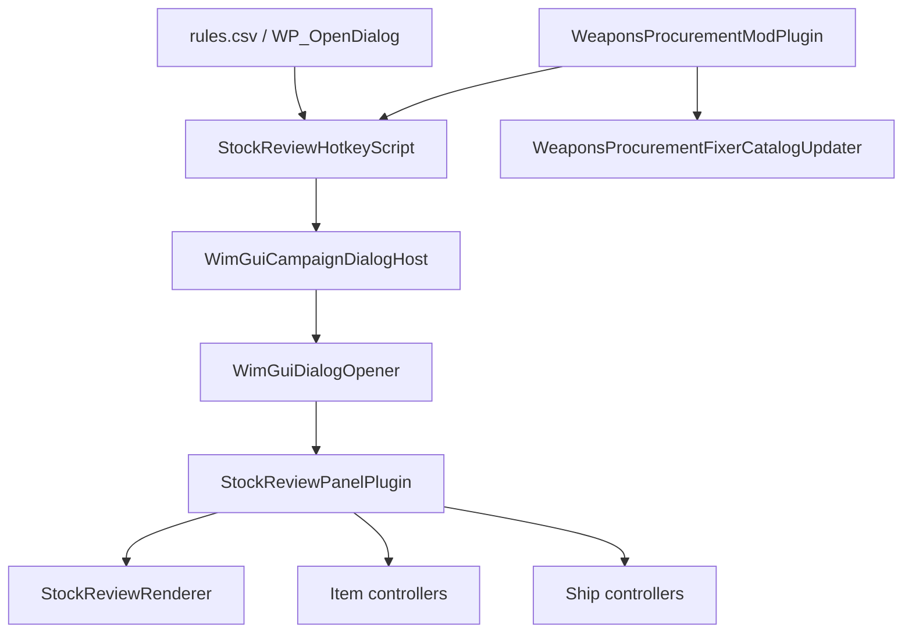
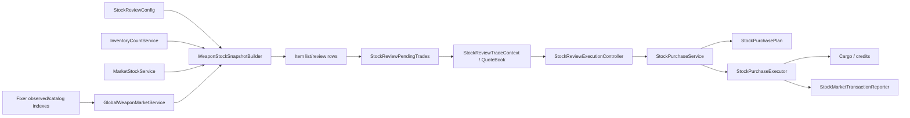
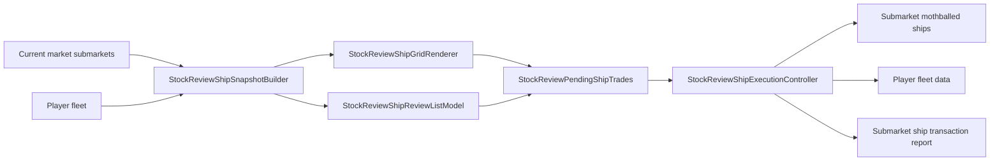
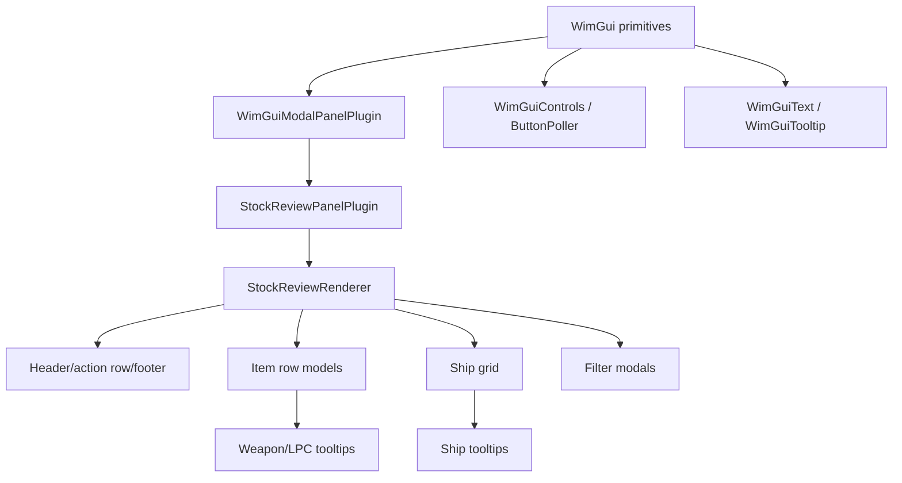
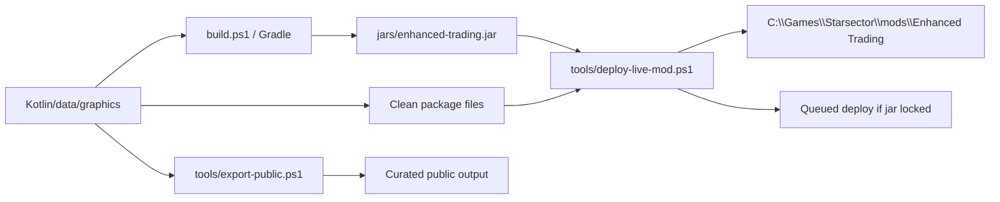

# Enhanced Trading Architecture Map

Last updated: 2026-05-19

Read this when you need to understand subsystem ownership before changing stock review, source modes, ship trading, tooltips, or deployment.

## Open Flow

`StockReviewHotkeyScript` is the only normal opener. It refreshes Luna settings, checks for a market-backed dialog, toggles close when the popup is already open, and hands launch state to `StockReviewPanelPlugin`.

## Item Stock And Trade Flow

Item stock is rebuilt from current player inventory plus the selected source mode. Local and Sector Market buys drain real cargo. Fixer's Market buys are virtual and use catalog/reference metadata.

## Ship Trade Flow

Ship trading is local-only. Records identify exact `FleetMemberAPI` instances by id and side. Remote ship sources are out of scope until virtual/source-draining semantics are designed.

## UI Layering

The custom UI stack exists because Starsector campaign custom panels are fragile. Preserve central button polling, modal input routing, text fitting, and sibling-safe panel anchoring.

## Package Map

| Package | Owns | Notes |
| --- | --- | --- |
| `weaponsprocurement.config` | Luna settings, JSON stock config, blacklists | `WeaponsProcurementConfig` publishes settings to `System` properties for cheap runtime reads. |
| `weaponsprocurement.lifecycle` | Campaign scripts | Hotkey/dialog open flow and Fixer observation live here. |
| `weaponsprocurement.plugins` | Mod plugin | Registers transient scripts only. Keep feature logic out. |
| `weaponsprocurement.stock.item` | Item identity, price/cargo-space references, snapshots | Use typed keys and central `StockItemStacks` pricing. |
| `weaponsprocurement.stock.market` | Local, Sector, and Fixer stock construction | Sector drains real cargo; Fixer is virtual. |
| `weaponsprocurement.stock.fixer` | Fixer observed/catalog/rarity metadata | Labels explain availability and sorting/filtering, not price multipliers. |
| `weaponsprocurement.stock.inventory` | Player plus accessible storage counts | Be careful with storage policy; generic non-market storage is not supported. |
| `weaponsprocurement.trade.*` | Item purchase planning, execution, rollback, reporting | Transaction reporting should happen after successful cargo/credit mutation. |
| `weaponsprocurement.ui` | Shared Starsector custom UI primitives | Reuse these helpers instead of raw custom-panel layout in feature code. |
| `weaponsprocurement.ui.stockreview.actions` | Action ids and dispatch groups | New buttons should route through explicit action groups. |
| `weaponsprocurement.ui.stockreview.rendering` | Modal shell, header/action/footer, stateful controllers | `StockReviewPanelPlugin` wires controllers; renderers build screens. |
| `weaponsprocurement.ui.stockreview.rows` | Item/review/filter rows and summaries | Keep repeated row geometry in row specs/cell groups. |
| `weaponsprocurement.ui.stockreview.ships` | Local-only ship trading | Build exact-member records, grid, filters, tooltip, and confirm flow here. |
| `weaponsprocurement.ui.stockreview.state` | Persistent popup state | Launch state carries pending/reopen state across modal rebuilds. |
| `weaponsprocurement.ui.stockreview.tooltips` | Item/wing tooltip panels | Shared tooltip cap and custom panel style live here. |

## Source Mode Map

| Mode | Stock source | Confirmation behavior | Black-market behavior |
| --- | --- | --- | --- |
| Local | Current market cargo | Drains current local submarket cargo | Toggle controls local open/black stock and local sell target. |
| Sector Market | Real cargo across sector markets | Drains exact remote source cargo | Remote buys may include black market if enabled; sells remain local legal buyer. |
| Fixer's Market | Virtual catalog/reference stock | Adds item to player cargo and charges credits; no real cargo drain | Black-market selling disabled; rarity/source tags are metadata. |

## Build And Deployment Map

Build success is source confidence, not runtime proof. For UI, Luna, data, graphics, or deploy work, verify the live target or perform in-game checks when the result matters.

## High-Risk Change Checklist

- Before source-mode or pricing changes, read `.agent/archive/deep-dives/trade-and-sources.md`.
- Before modal, row, tooltip, button, or custom-panel work, read `.agent/archive/deep-dives/starsector-ui.md`.
- Before vanilla weapon tooltip parity work, read `.agent/archive/deep-dives/vanilla-weapon-tooltip-bytecode.md`.
- Before release or live deploy validation, read `.agent/archive/deep-dives/runtime-validation.md`.
- Before public export, read `.agent/PUBLIC_RELEASE.md`.

## Extension Points

- New item field: add source data to `WeaponStockRecord`, render in row/tooltip helpers, and validate width/truncation with debug records.
- New bulk action: route through `StockReviewAction`, `StockReviewTradeActionDispatcher`, and the appropriate controller. Respect active filters unless deliberately global.
- New ship filter: add state, modal control, `StockReviewShipFilters.matches`, and page/scroll reset behavior.
- New source mode: update source state, snapshot construction, quote planning, execution, UI labels, remote sell policy, and archive the semantics.
- New debug UI: gate behind `wp_enable_debug_ui` and reuse normal render/tooltip paths.
